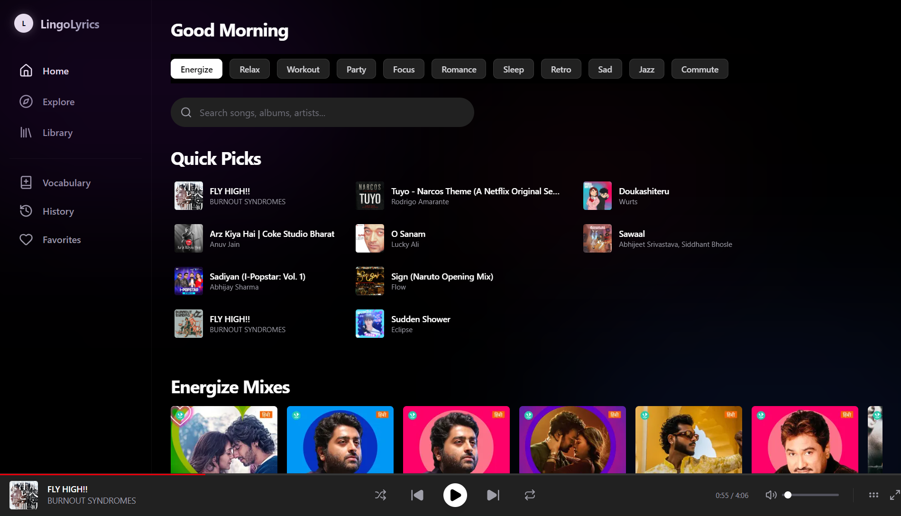
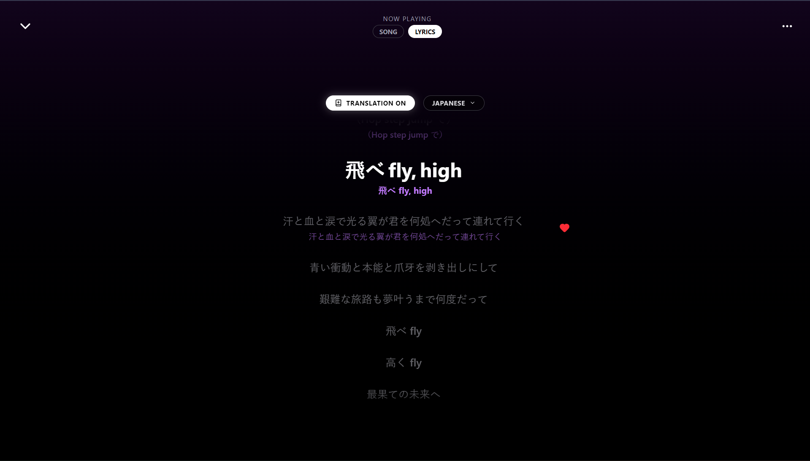
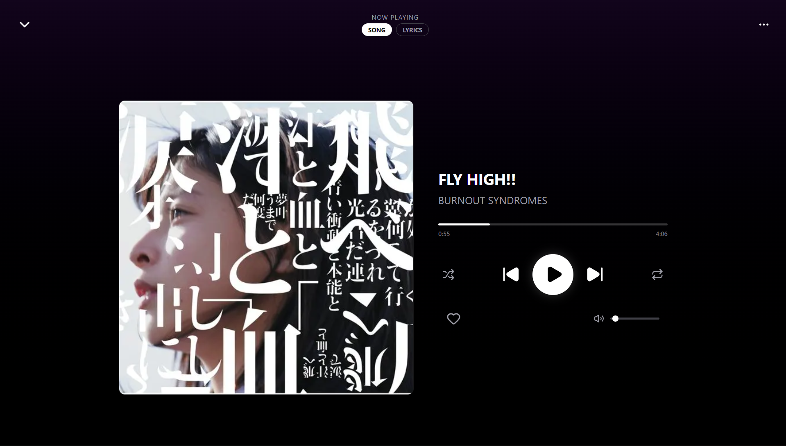
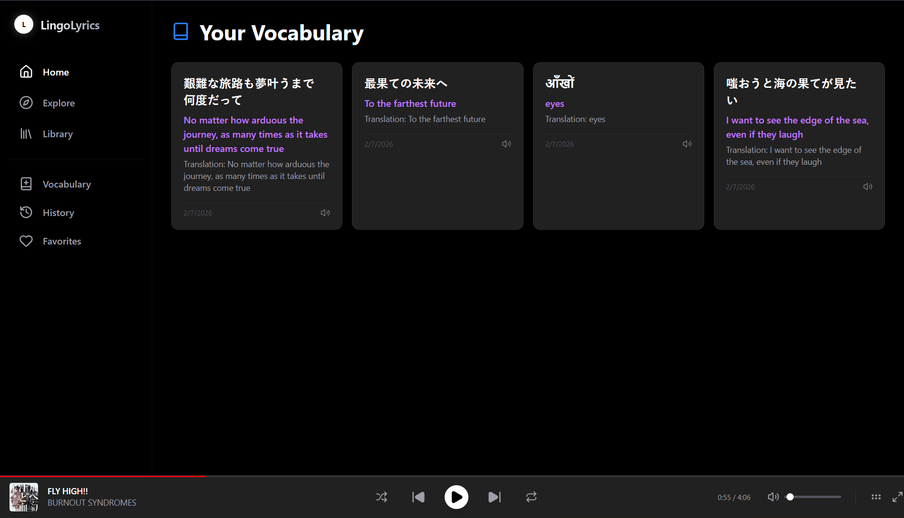

<div align="center">
  <h1>LingoLyrics 🎵</h1>
  <p><strong>Listen. Learn. Connect.</strong></p>
  <p>The first music streaming platform that turns every song into a language lesson.</p>

  👉 **[Watch the demo on YouTube](https://www.youtube.com/watch?v=zQcwzZFDLzY)**

https://github.com/user-attachments/assets/d642cbd7-1791-4389-9847-610c799317fb
  
  
  <a href="https://lingo-lyrics.vercel.app" target="_blank">View Live Demo</a>
</div>

---

## 💡 The Problem
Music is the universal language, but **lyrics often get lost in translation**. 
We listen to K-Pop, Spanish Reggaeton, or Bollywood hits without understanding the soul behind the words. Existing tools are clunky—you have to pause, switch apps, and translate manually. The immersion is broken.

## 🚀 The Solution: LingoLyrics
LingoLyrics bridges the gap between entertainment and education. It's a full-featured music player that syncs lyrics in real-time and provides **instant, magical translations** for any word or sentence you select without ever pausing the music.

### ✨ Key Features (The "Wow" Factor)

*   **🪄 Magic Selection Translation**: Just highlight any lyric—Japanese, Hindi, Spanish—and get an instant, auto-detected translation overlay. It feels like magic.
*   **📚 Smart Vocabulary Deck**: Save interesting words or phrases with one click. Review them later with built-in **AI Pronunciation** to master the accent.
*   **🎤 Real-Time Synced Lyrics**: Karaoke-style scrolling lyrics for millions of songs.
*   **🧠 Intelligent Search**: Powered by a custom algorithm that merges results from multiple APIs (JioSaavn + Invidious) to find *exactly* what you're looking for.
*   **🎨 Premium "App-Like" Feel**: Built with glassmorphism, fluid animations (Framer Motion), and a responsive design that feels native on any device.

---

## 🛠️ Tech Stack

Built with the bleeding edge of modern web tech:

*   **Framework**: [Next.js 15 (App Router)](https://nextjs.org/)
*   **Styling**: [Tailwind CSS](https://tailwindcss.com/) + Glassmorphism
*   **Animations**: [Framer Motion](https://www.framer.com/motion/)
*   **Translation AI**: [Lingo.dev SDK](https://lingo.dev/) & [Google Translate API](https://cloud.google.com/translate)
*   **Music API**: Custom JioSaavn Wrapper
*   **Search Intelligence**: Invidious API + DuckDuckGo Fallback

---

## 📸 Screenshots

| Home Page | Magic Translation |
|:---:|:---:|
|  |  |

| Immersive Player | Vocabulary Builder |
|:---:|:---:|
|  |  |

---

## 🏃‍♂️ Getting Started

1.  **Clone the repo**
    ```bash
    git clone https://github.com/pavitra0/lingo-lyrics.git
    cd lingo-lyrics
    ```

2.  **Install packages**
    ```bash
    npm install
    ```

3.  **Run locally**
    ```bash
    npm run dev
    ```

---

## 🔮 What's Next?
*   **Duolingo-style gamification**: Earn XP for learning new words from songs.
*   **Social**: Share your favorite translated lyric cards on Instagram Stories.
*   **Multi-language**: Support for even more regional dialects.

---

<div align="center">
  Made with ❤️ by pavitra0
</div>
